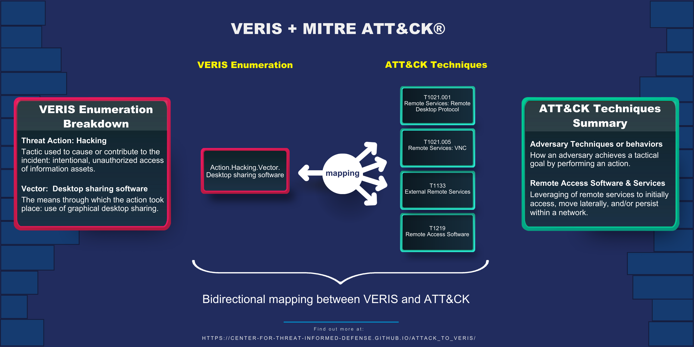

# VERIS Mappings to MITRE ATT&CK®

[Vocabulary for Event Recording and Incident Sharing
(VERIS)](https://verisframework.org/) provides a common language for describing
cybersecurity incidents–including the demographics, metadata, and technical details–in a
repeatable manner. As a standard representation, it allows for the analysis of data
across a variety of incidents and is used, among other things, to generate the [Verizon
Data Breach Investigation Report
(DBIR)](https://www.verizon.com/business/resources/reports/dbir/). While VERIS is
comprehensive in describing most aspects of cybersecurity incidents, it is focused on a
high-level description of an incident as a whole, and as such does not provide the level
of fidelity that [MITRE ATT&CK®](https://attack.mitre.org/) provides in describing the
adversary behaviors that were used to carry out an attack at the system level.

**Table Of Contents:**

- [Overview](#overview)
- [Getting Started](#getting-started)
- [Getting Involved](#getting-involved)
- [Questions and Feedback](#questions-and-feedback)
- [Notice](#notice)

## Overview

The project provides a mapping and translation layer between VERIS v1.3.7 and ATT&CK v12.1 that
allows for describing adversary behaviors that are observed in an incident coded in
VERIS. This draws upon the strengths of VERIS (incident demographics and metadata) and
the strengths of ATT&CK (the behaviors adversaries use to attack systems) to provide a
fuller and more detailed picture of cyber incidents, including the threat actor,
technical behavior, assets targeted, and impact.

While VERIS allows for the expression of all these aspects, ATT&CK provides a
significant improvement in level of detail, consistency of detail, and comprehensiveness
in describing technical behaviors. These improvements can be used to develop better
predictions and insights about how we might be attacked in the future by understanding
better how and why we were attacked in the past.

This project includes mappings from VERIS to:

- Enterprise ATT&CK
- Mobile ATT&CK
- ICS ATT&CK
- ATT&CK Groups

The example below shows the bidirectional mapping of the VERIS Action Hacking Vector's
Desktop sharing software to a more granular set of ATT&CK techniques. This granular
description of an adversary's behavior allows users to better understand how to detect
and mitigate the threat.

The mapping structure, use cases, and scenarios are fully described on [the project
website](https://center-for-threat-informed-defense.github.io/attack_to_veris/).

## Getting Started

| Resource                                                                                 | Description                                                                        |
| ---------------------------------------------------------------------------------------- | ---------------------------------------------------------------------------------- |
| [Project Website](https://center-for-threat-informed-defense.github.io/attack_to_veris/) | Documentation, scenarios, and use cases for VERIS mappings.                        |
| [VERIS to ATT&CK Mappings](./src/mappings/)                                              | VERIS framework mappings to ATT&CK.                                                |
| [ATT&CK Navigator Layers – Enterprise](./src/stix/output/enterprise/layers/)             | ATT&CK Navigator layers representing the mappings from Enterprise ATT&CK to VERIS. |
| [ATT&CK Navigator Layers – Mobile](./src/stix/output/mobile/layers/)                     | ATT&CK Navigator layers representing the mappings from Mobile ATT&CK to VERIS.     |
| [ATT&CK Navigator Layers – ICS](./src/stix/output/ics/layers/)                           | ATT&CK Navigator layers representing the mappings from ICS ATT&CK to VERIS.        |
| [ATT&CK Navigator Layers – Groups](./src/stix/output/groups/layers/)                     | ATT&CK Navigator layers representing the mappings from ATT&CK Groups to VERIS.     |

## Getting Involved

There are several ways that you can get involved with this project and help advance
threat-informed defense.

Please review the mappings, use them, and tell us what you think. We welcome your review
and feedback on the VERIS mappings, our methodology, and resources.

We are interested developing additional tools and resources to help the community
understand and make threat-informed decisions in their risk management programs. Share
your ideas and we will consider them as we explore additional research projects.

## Questions and Feedback

Please submit issues for any technical questions/concerns or contact
ctid@mitre-engenuity.org directly for more general inquiries.

Also see the guidance for contributors if are you interested in [contributing or simply
reporting issues.](/CONTRIBUTING.md)

## Notice
Copyright 2021-2023 MITRE Engenuity. Approved for public release. Document number CT0064

Licensed under the Apache License, Version 2.0 (the "License"); you may not use this
file except in compliance with the License. You may obtain a copy of the License at

http://www.apache.org/licenses/LICENSE-2.0

Unless required by applicable law or agreed to in writing, software distributed under
the License is distributed on an "AS IS" BASIS, WITHOUT WARRANTIES OR CONDITIONS OF ANY
KIND, either express or implied. See the License for the specific language governing
permissions and limitations under the License.

This project makes use of MITRE ATT&CK®

[ATT&CK Terms of Use](https://attack.mitre.org/resources/terms-of-use/)
