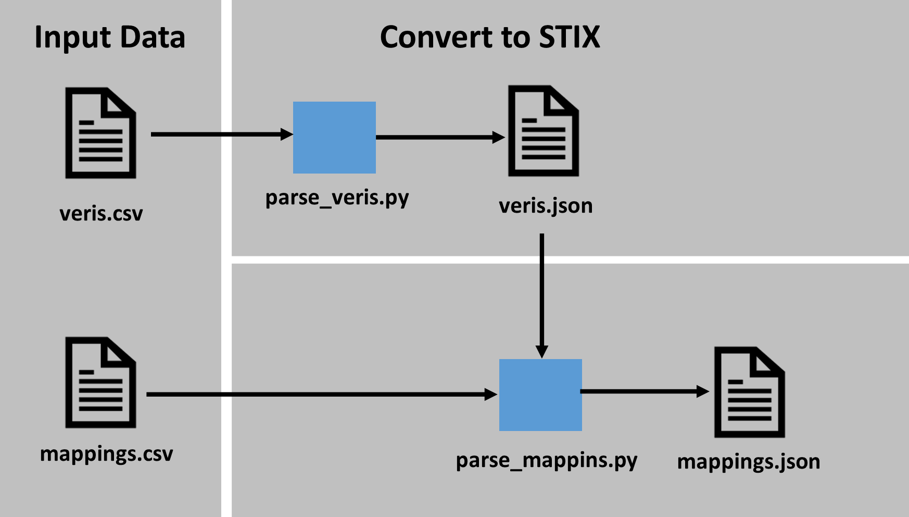

# Tooling
This document describes the python tools supplied to support the creation of new mappings or the customization of existing mappings. The scripts in this repository are provided in case users want to extend the mappings locally and need to rebuild the artifacts. If you are simply ingesting the data from this repository, you likely will not need to install or run any of the provided scripts.

## Install

### Requirements

- [python](https://www.python.org/) 3.6 or greater

### Environment setup

From the root directory of this repository:
1. Create a virtual environment: 
    - macOS and Linux: `python3 -m venv attack-to-veris`
    - Windows: `py -m venv attack-to-veris`
2. Activate the virtual environment: 
    - macOS and Linux: `source attack-to-veris/bin/activate`
    - Windows: `attack-to-veris/Scripts/activate`
3. Install requirement packages: `pip install -r requirements.txt`

## Usage

### Rebuilding the STIX data
To rebuild all the data in the repository based on the most up-to-date input data, run `python make.py` within the src/ directory of the repository.

To rebuild the STIX data for the VERIS framework:
1. run `python parser.py` from within the folder of the given framework. This will rebuild the raw STIX data from the input spreadsheets.
2. use the scripts in [src](/src/) to regenerate the ancillary veris data such as ATT&CK Navigator layers.

### Utility scripts
The [/src/](/src/) folder includes utility scripts designed to work with generic frameworks and mappings that implement the format described in [the STIX format document](/docs/STIX_format.md). Please see the readme in the util folder for more details of the functionality of these scripts. The output of these scripts is already present within the framework folders; the scripts are provided for users who wish to extend or otherwise modify the defined mappings and need to rebuild the artifacts provided by this repository.

## Tooling Architecture 
If you wish to extend or otherwise modify the mappings provided in this repository, the data in the `/input/` folder of the framework may be modified. The python scripts provided in this repository transform this input data into the various output formats listed above. Please see the [install](#install) section for more on how to set up this repository for local use if you intend to extend the defined mappings. 

### Input Data
The VERIS framework has one input for the veris objects and one for the mappings. The mappings input data were created as part of this project. 

### Framework Parser

*Above: overview of the parser structure*

The framework parser consists of two major parts, `parse_veris.py` and the `parse_mappings.py`. These are coupled together with `parse.py` which performs both operations sequentially. 
- `parse_veris.py` takes as input the veris enumeration spreadsheet and builds a STIX 2.0 representation of the veris framework. Because the representation of each framework differs, this script will likely have to be rewritten for new additional frameworks since the input data format is not standardized.
- `parse_mappings.py` takes as input the mappings spreadsheet, and the STIX representation of the veris framework and builds a STIX 2.0 representation of the mappings to ATT&CK. Because the input mappings file format can be standardized, this parser can often be reused when adding additional frameworks.

### Output data

The parser system outlined above produces a series of STIX 2.0 Bundle objects representing the veris framework as well as mappings to ATT&CK. See the README of the `stix` folder for a given framework for a description of each file:
- [VERIS STIX data](/frameworks/veris/stix/)

## See also
- [STIX Format](/docs/STIX_format.md) for more information about the STIX representation of the veris objects and mappings.
- [Visualization](/docs/visualization.md) for more information about how to visualize the mappings.
