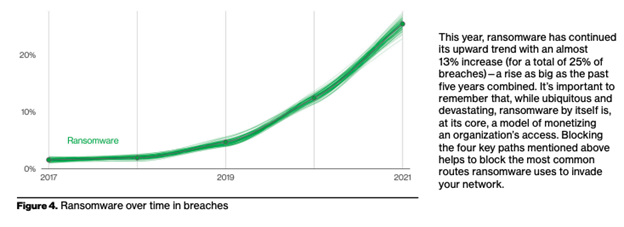

Example Scenarios
=================

This chapter presents example scenarios to demonstrate how the mapping and translation
layer between `VERIS <https://verisframework.org/>`_ and `ATT&CK
<https://attack.mitre.org/>`_ can be used to capture and describe real-world incidents.
Each scenario demonstrates the opportunity for a joint analysis of adversary behaviors
and incident demographics.

Each scenario is presented in the following format:

a.  Overview of the Attack
b.  Translation between VERIS and ATT&CK
c.  Role-Based Use Cases
d.  References

SolarWinds Supply Chain Breach (Enterprise Environment)
-------------------------------------------------------

Overview of the Attack
~~~~~~~~~~~~~~~~~~~~~~

SolarWinds Orion cyberattack, also known as Solorigate, is a highly sophisticated cyber
supply chain attack that took place in late 2020. The attack targeted SolarWinds, a
Texas-based technology company that provides information technology (IT) management
software to thousands of organizations worldwide. The attackers managed to compromise
SolarWinds' software by inserting malicious code into a software update that was pushed
out to customers. The malicious code gave the attackers access to the networks of the
organizations that used SolarWinds' software, allowing them to steal sensitive
information and carry out further attacks. With an estimated 18,000 customers exposed to
this malware strain, the SolarWinds Orion update attack may be regarded as the costliest
cyberattack on record. The United States government formally attributed the SolarWinds
Orion operation to the Russian Foreign Intelligence Service (SVR) and the Nobelium
threat actor (APT29).

The Solorigate attack was considered one of the most damaging cyberattacks in recent
years due to its widespread impact. The list of organizations affected by the attack
includes major corporations, government agencies, and critical infrastructure providers.
The attackers used a range of techniques to hide their activities, making it difficult
for organizations to detect this compromise. It was discovered that the attackers had
been operating in the affected networks for several months before being detected. The
attack has raised concerns about the security of the software supply chain and the need
for organizations to adopt better security practices to prevent similar attacks in the
future.

Supply chain attacks typically involve a sequence of one or more breaches chained
together. Solorigate is an example where vendor software is compromised and used to push
a malicious update to customers, resulting in the initial breaches. Other examples of
supply chain attacks involve compromising a partner or third party that shares a
business relationship with an organization, such as vendors, hosting providers, or
outsourced support, and using either valid credentials or a trusted connection to then
gain access to the organization. This is demonstrated in the figure below from the `2022
Verizon Data Breach Investigations Report (DBIR)
<https://www.verizon.com/business/resources/reports/dbir/>`_:

.. image:: _static/dbir_figure7.png
   :width: 600

Translation between VERIS and ATT&CK
~~~~~~~~~~~~~~~~~~~~~~~~~~~~~~~~~~~~

The VERIS/ATT&CK mapping provides a joint framework to comprehensively describe security
events at a flexible level. The table below correlates the actions observed in this
incident enumerated in VERIS to the 15 specific underlying adversary ATT&CK Tools,
Techniques, and Procedures (TTPs) used to carry out the cyberattack.

+------------------------------------------+------------------------------------------+
+ VERIS Enumeration                        + ATT&CK (Sub)Technique                    +
+==========================================+==========================================+
+ action.hacking.variety.Abuse of          + T1218.011 Signed Binary Proxy Execution: +
+ functionality                            + Rundll32                                 +
+------------------------------------------+------------------------------------------+
+ action.hacking.vector.Command shell      + T1047 Windows Management Instrumentation +
+                                          + (WMI)                                    +
+------------------------------------------+------------------------------------------+
+ attribute.integrity.variety.Alter        + T1546.003 Event Triggered Execution:     +
+ behavior                                 + Windows Management Instrumentation Event +
+                                          + Subscription                             +
+------------------------------------------+------------------------------------------+
+ action.malware.variety.Disable controls  + T1562.002 Impair Defenses: Disable       +
+                                          + Windows Event Logging                    +
+------------------------------------------+------------------------------------------+
+ action.malware.variety.Disable controls  + T1562.004 Impair Defenses: Disable or    +
+                                          + Modify System Firewall                   +
+------------------------------------------+------------------------------------------+
+ action.malware.variety.Disable controls  + T1562.001 Impair Defenses: Disable or    +
+                                          + Modify Tools                             +
+------------------------------------------+------------------------------------------+
+ action.hacking.variety.Footprinting      + T1057 Process Discovery                  +
+                                          +                                          +
+------------------------------------------+------------------------------------------+
+ action.malware.variety.Destroy data      + T1070.006 Indicator Removal on Host:     +
+                                          + Timestomp                                +
+------------------------------------------+------------------------------------------+
+ action.malware.variety.Export data       + T1567.002 Exfiltration Over Web Service: +
+                                          + Exfiltration to Cloud Storage            +
+------------------------------------------+------------------------------------------+
+ action.malware.variety.Modify data       + T1560.001 Archive Collected Data:        +
+                                          + Archive via Utility                      +
+------------------------------------------+------------------------------------------+
+ action.malware.variety.Capture stored    + T1555 Credentials from Password Stores   +
+ data                                     +                                          +
+------------------------------------------+------------------------------------------+
+ action.malware.variety.Capture stored    + T1003.006 OS Credential Dumping: DCSync  +
+ data                                     +                                          +
+ action.malware.variety.Password dumper   +                                          +
+------------------------------------------+------------------------------------------+
+ action.hacking.variety.Use of stolen     + T1558.003 Steal or Forge Kerberos        +
+ creds                                    + Tickets: Kerberoasting                   +
+------------------------------------------+------------------------------------------+
+ action.malware.variety.Scan network      + T1482 Domain Trust Discovery             +
+                                          +                                          +
+------------------------------------------+------------------------------------------+
+ action.malware.variety.Scan network      + T1018 Remote System Discovery            +
+                                          +                                          +
+------------------------------------------+------------------------------------------+
+ action.malware.vector.Partner            + T1195 Supply Chain Compromise            +
+ action.malware.vector.Software update    +                                          +
+------------------------------------------+------------------------------------------+

Role-Based Use Cases
~~~~~~~~~~~~~~~~~~~~

The essential capabilities enabled by the VERIS/ATT&CK mapping support a variety of use
cases that can be used to create a fuller and more detailed picture of cyber incidents
including the threat actor, technical behavior, assets targeted, and impact. Several of
those use cases are described below in the context of Solorigate.

As an Incident Response (IR) professional, I can ensure I have a complete picture of an active security incident:
    The mapping can be used to assist an IR professional to use the observed adversary
    behaviors as described in ATT&CK to then code that incident in VERIS. When using VERIS
    to capture this incident, the techniques observed during APT29's SolarWinds campaign
    show the Vectors and Varieties used by the attackers in this supply chain compromise
    cyber operation. The VERIS framework can be used to document and build out the
    description of the incident as a whole.

As a Chief Information Security Officer or Information System Security Officer (CISO/ISSO), I understand how our current security posture addresses real-world threats that my organization is likely to encounter:
    Organizational security posture can be assessed by observing the threat group's list of
    related techniques against similar environments. For example, Russia's SVR group known
    as `APT29 <https://attack.mitre.org/groups/G0016/>`_ has also been known to use more
    than 60 additional MITRE ATT&CK techniques. ATT&CK Group layers showing TTPS of APT29
    and groups linked with APT29 that are mapped to `actor.external.motive.Espionage
    <https://verisframework.org/actors.html#section-external>`_ can help to provide the full
    picture of adversary TTPs being used in real-world attacks.

As a Security Operations Center (SOC) analyst, I know that we have sufficient visibility into threats launched against my organization:
    SOC analysts can ensure that detection and mitigation mechanisms are in place for the
    observed techniques. For example, detection of `T1195 Supply Chain Compromise
    <https://attack.mitre.org/techniques/T1195/>`_ includes monitoring of file metadata.
    Monitoring and vulnerability scanning of software updates should be conducted prior to
    and after deployment to identify potential suspicious activity. Notably, the compromised
    DLL file that called a backdoor was digitally signed. SOC analysts can review the
    associated Techniques as well as Detection methods from `T1218.011 System Binary Proxy
    Execution: Rundll32 <https://attack.mitre.org/techniques/T1218/011/>`_ to ensure methods
    are in place to confirm the origin and purpose of DLL files. The VERIS mappings to
    adversary techniques used can help describe areas to look for additional indicators,
    such as `action.malware.vector.Software update
    <https://verisframework.org/actions.html>`_ and `action.hacking.variety.Abuse of
    functionality <https://verisframework.org/actions.html#section-hacking>`_.

As a Security Engineer, I understand the following mitigations are necessary to prevent classes of attacker activity:
    Continuous monitoring of vulnerability sources, code review processes, and patch
    management can be implemented to help prevent and identify adversary techniques and
    indicators of compromise. The mappings can be used to determine additional areas such as
    attack vectors that need attention. Controls should be put in place for monitoring
    malicious additions, unused or vulnerable software or dependencies, unnecessary features
    or components, and modified or new files associated with legitimate software
    distribution or updates.

References
~~~~~~~~~~

-   `Deep dive into the Solorigate second-stage activation: From SUNBURST to TEARDROP
    and Raindrop - Microsoft Security Blog
    <https://www.microsoft.com/en-us/security/blog/2021/01/20/deep-dive-into-the-solorigate-second-stage-activation-from-sunburst-to-teardrop-and-raindrop/>`_
-   `Highly Evasive Attacker Leverages SolarWinds Supply Chain to Compromise Multiple
    Global Victims With SUNBURST Backdoor | Mandiant
    <https://www.mandiant.com/resources/blog/evasive-attacker-leverages-solarwinds-supply-chain-compromises-with-sunburst-backdoor>`_
-   `CSA_SVR_TARGETS_US_ALLIES_UOO13234021.PDF (defense.gov)
    <https://media.defense.gov/2021/Apr/15/2002621240/-1/-1/0/CSA_SVR_TARGETS_US_ALLIES_UOO13234021.PDF>`_

Colonial Pipeline Ransomware (IT/ICS Environment)
-------------------------------------------------

Overview of the Attack
~~~~~~~~~~~~~~~~~~~~~~

The Colonial Pipeline ransomware attack was a significant cyberattack and potentially
the most well-known attack on industrial control systems (ICS) in May 2021. The Verizon
2022 DBIR Report notes this attack as one of 2021's milestone breaches. The attack
targeted the Colonial Pipeline, a critical piece of infrastructure that carries
gasoline, diesel, and jet fuel from Texas to New York. Modern ICS such as Colonial
Pipeline rely on IT infrastructures that interface with a variety of networks and
systems. The attackers were able to access systems using a stolen password and then used
a strain of ransomware called DarkSide to encrypt Colonial Pipeline's computer systems
and disrupt operations. The company was forced to temporarily shut down its entire
pipeline network, which supplies nearly half of the East Coast's fuel. The closure
lasted six days.

The attack caused panic and confusion among the American public, leading to gas
shortages and long lines at gas stations in several states. The US government declared a
state of emergency in response to the attack, and several government agencies worked
together to try to mitigate the impact of the attack. Colonial Pipeline eventually
agreed to pay the ransom demand of the attackers, reportedly 75 Bitcoin, worth about $5
million at the time. The payment sparked a debate about whether companies should pay
ransoms to cybercriminals, and whether the US government should take a more active role
in addressing ransomware attacks.

This cyberattack use case demonstrates the evaluation of risks in modern environments
where cyber-physical technologies are necessary for operations. Examples of other types
of industries affected by ICS attacks include Manufacturing and Mining, Quarrying, and
Oil & Gas Extraction Utilities (MQOGEU). Ransomware type of attacks are a newer tracked
risk in the cyber landscape that have been observed to be on the rise since early 2019,
as seen in the figure below from the `Verizon 2022 DBIR
</https://www.verizon.com/business/resources/reports/dbir/>`__:

Translation between VERIS and ATT&CK
~~~~~~~~~~~~~~~~~~~~~~~~~~~~~~~~~~~~

MITRE ATT&CK for Industrial Control Systems (ICS) is a curated knowledge base for cyber
adversary behavior in the ICS technology domain. The 2022 update to this VERIS/ATT&CK
mapping project extends the VERIS schema incorporation to ATT&CK for ICS mappings. The
table below links the associated Colonial Pipeline incidents as described in VERIS to
the specific underlying adversary ATT&CK TTPs used to carry out the attack.

+------------------------------------------+------------------------------------------+
+ VERIS Enumeration                        + ATT&CK (Sub)Technique                    +
+==========================================+==========================================+
+ action.social.variety.Phishing           + T1566 Phishing                           +
+                                          +                                          +
+------------------------------------------+------------------------------------------+
+ action.malware.variety.Exploit misconfig + T1190 Exploit Public-Facing Application  +
+ action.malware.variety.Client-side       +                                          +
+ attack                                   +                                          +
+------------------------------------------+------------------------------------------+
+ action.hacking.variety.Backdoor          + T1133 External Remote Services           +
+                                          +                                          +
+------------------------------------------+------------------------------------------+
+ action.malware.variety.Ransomware        + T1486 Data Encrypted for Impact          +
+                                          +                                          +
+------------------------------------------+------------------------------------------+
+ action.malware.variety.C2                + T1090.003 Proxy: Multi-hop Proxy         +
+                                          +                                          +
+------------------------------------------+------------------------------------------+
+ attribute.availability.Variety           + T0826 Loss of Availability               +
+                                          +                                          +
+------------------------------------------+------------------------------------------+

Role-Based Use Cases
~~~~~~~~~~~~~~~~~~~~

The essential capabilities enabled by the VERIS/ATT&CK mapping support a variety of use
cases that can be used to create a fuller and more detailed picture of cyber incidents
including the threat actor, technical behavior, assets targeted, and impact. Several of
those use cases are described below in the context of ransomware and the Colonial
Pipeline incident.

As an IR professional, I can ensure I have a complete picture of an active security incident.
    The list of six (sub-)techniques observed during the Darkside actor campaign describes
    how the attackers achieved their goals and interrupt operations. The mapping can be used
    to assist an IR professional take the observed adversary behaviors as described in
    ATT&CK to then code the incident in VERIS to begin to build out the incident
    demographics and metadata towards determining overall impact.

As a CISO/ISSO, I understand how our current security posture addresses real-world threats that my organization is likely to encounter.
    Organizational security posture can be assessed by observing the threat group's list of
    related techniques in similar incidents. For example, Darkside actors (`Fin7
    <https://attack.mitre.org/groups/G0046/>`_) are known to use ransomware and have also
    been observed using more than 30 additional ATT&CK techniques. The Verizon 2022 DBIR
    notes a 13% increase in ransomware-related breaches and in 82% of cases the attacker
    targeted the human element, with social attacks (e.g., phishing) serving as the initial
    access vector. Other ATT&CK Techniques mapped to `action.malware.variety.Ransomware
    <https://verisframework.org/actions.html#section-malware>`_ and Groups mapped to
    `actor.external.motive.Financial
    <https://verisframework.org/actors.html#section-external>`_ can provide additional
    context for known real-world threats linked to ransomware.

As a SOC analyst, I know that we have sufficient visibility into threats launched against my organization.
    The attacker's initial point of entry was through usage of a valid stolen password.
    Detection mechanisms for `T1566 Phishing <https://attack.mitre.org/techniques/T1566/>`_
    can be established for identifiable phishing TTPs using application log data, file
    creation data, and network traffic. The mapping to `action.social.variety.Phishing
    <https://verisframework.org/actions.html#section-social>`_ can help to describe areas
    needing additional actions such as user training re-enforcing types of spearphishing
    emails and appropriate handling of those emails.

As a Security Engineer, I understand the following mitigations are necessary to prevent classes of attacker activity.
    Build in defense-in-depth as mitigations for specific adversary TTPs and each applicable
    technique. Defense-in-depth includes use of anti-virus/anti-malware, network intrusion
    prevention systems (IPS), restricting web-based content, maintaining software
    configurations, and user training. The mappings can be used to identify areas to expand
    focus, such as `action.malware.variety.Exploit misconfig
    <https://verisframework.org/actions.html#section-malware>`_,
    `action.malware.variety.Client-side attack
    <https://verisframework.org/actions.html#section-malware>`_, and
    `action.hacking.variety.Backdoor
    <https://verisframework.org/actions.html#section-hacking>`_.

References
~~~~~~~~~~

-   `DarkSide Ransomware: Best Practices for Preventing Business Disruption from
    Ransomware Attacks | CISA <https://www.cisa.gov/uscert/ncas/alerts/aa21-131a>`_
-   `ATTACK for ICS - Philosophy Paper - Final.docx (mitre.org)
    <https://attack.mitre.org/docs/ATTACK_for_ICS_Philosophy_March_2020.pdf>`_
-   `Colonial Pipeline Cyberattack Highlights Need for Better Federal and Private-Sector
    Preparedness (infographic) | U.S. GAO
    <https://www.gao.gov/blog/colonial-pipeline-cyberattack-highlights-need-better-federal-and-private-sector-preparedness-infographic>`_`

Anthem Data Breach (Espionage Motivated Threat Actor)
-----------------------------------------------------------

Overview of the Attack
~~~~~~~~~~~~~~~~~~~~~~

In February 2015, a large health insurer known as Anthem, Inc., disclosed an attack that
compromised the personally identifiable information (PII) of about 78.8 million
individuals, which is about twice the population of California. The Anthem attack has
been noted as the largest healthcare breach in history and has been linked to Deep
Panda, a Chinese cyber espionage group. The attack used techniques such as customized
spearphishing emails, backdoor malware, lateral movement, and privilege escalation to
breach the company and then steal millions of records and extract PII.

In addition to Anthem, three other companies were affected, but their names were not
disclosed in the formal accusation released May 9, 2019. According to the indictment,
data such as names, health identification numbers, dates of birth, Social Security
numbers, addresses, telephone numbers, email addresses, employment information and
income were exfiltrated. As a result of this breach, Anthem faced several civil
class-action lawsuits, which were settled in 2017 at a cost of $115 million, and in 2018
Anthem paid a record-setting $16 million settlement to the Office for Civil Rights for
Health Insurance Portability and Accountability Act (HIPAA) violations.

In addition to Anthem, three other companies were affected, but their names were not
disclosed in the formal accusation released May 9, 2019. According to the indictment,
data such as names, health identification numbers, dates of birth, Social Security
numbers, addresses, telephone numbers, email addresses, employment information and
income were exfiltrated. As a result of this breach, Anthem faced several civil
class-action lawsuits, which were settled in 2017 at a cost of $115 million, and in 2018
Anthem paid a record-setting $16 million settlement to the Office for Civil Rights for
Health Insurance Portability and Accountability Act (HIPAA) violations.

Espionage-related attacks have been significantly increasing over time, coming in as the
second most common motive reported in the Verizon 2022 DBIR over the last few years. The
top compromised data types are credentials and personal data, as seen in the `Verizon
2022 DBIR <https://www.verizon.com/business/resources/reports/dbir/>`__ figure below.
Credentials are useful for masquerading as legitimate users on networks and systems.
Personal data exfiltration, such as email addresses, can be used for financial fraud and
there is a large market for their resale.

.. image:: _static/dbir_figure27.png
   :width: 600

Translation between VERIS and ATT&CK
~~~~~~~~~~~~~~~~~~~~~~~~~~~~~~~~~~~~

The VERIS/ATT&CK mapping provides a joint framework to comprehensively describe security
events at a flexible level. The below table links the Anthem hack techniques in VERIS to
the specific underlying adversary ATT&CK TTPs used to carry out the attack.

+------------------------------------------+------------------------------------------+
+ VERIS Enumeration                        + ATT&CK (Sub)Technique                    +
+==========================================+==========================================+
+ action.social.variety.Phishing           + T1566.002 Phishing: Spearphishing Link   +
+                                          +                                          +
+------------------------------------------+------------------------------------------+
+ action.malware.variety.Capture stored    + T1083 File and Directory Discovery       +
+ data                                     +                                          +
+------------------------------------------+------------------------------------------+
+ action.malware.variety.C2                + T1573 Encrypted Channel                  +
+                                          +                                          +
+------------------------------------------+------------------------------------------+
+ Action.malware.variety.Evade defenses    + T1553 Subvert Trust Controls             +
+                                          +                                          +
+------------------------------------------+------------------------------------------+
+ action.hacking.variety.Scan network      + T1018 Remote System Discovery            +
+                                          +                                          +
+------------------------------------------+------------------------------------------+
+ action.malware.variety.Backdoor          + T1133 External Remote Services           +
+                                          +                                          +
+------------------------------------------+------------------------------------------+

Role-Based Use Cases
~~~~~~~~~~~~~~~~~~~~

The essential capabilities enabled by the VERIS/ATT&CK mapping support a variety of use
cases that can be used to create a fuller and more detailed picture of cyber incidents
including the threat actor, technical behavior, assets targeted, and impact. Several of
those use cases are described below in the context of the theft of company data.

As an IR professional, I can ensure I have a complete picture of an active security incident.
    The VERIS to ATT&CK mappings help to understand what to look for in logs, network
    traffic, and potential fake domain names to identify potential espionage attacks that
    are trying to steal intellectual property and other corporate data. When using VERIS to
    record an incident, the Timeline section will offer specific questions to help an IR
    professional walk through the various stages of a security incident. Answers to
    questions such as “How long from initial compromise to first known data exfiltration?”
    may be found in system, host, or network logs as indicated under the Detection section
    of the ATT&CK Techniques.

As a CISO/ISSO, I understand how our current security posture addresses real-world threats that my organization is likely to encounter.
    While this attack has been attributed to Deep Panda, there is speculation Deep Panda is
    also APT 19, but that is still unclear. To provide a more complete analysis of company
    security posture, note the initial compromise was due to spearphishing and review `Deep
    Panda's <https://attack.mitre.org/groups/G0009/>`_ 10 Techniques commonly used as well
    as `APT 19's <https://attack.mitre.org/groups/G0073/>`_ set of approximately 20
    Techniques commonly used to breach organizations. Understanding other groups with
    similar motives mapped to actor.external.motive.Espionage and their associated TTPs can
    build out the bigger picture of the threat landscape.

As a SOC analyst, I know that we have sufficient visibility into threats launched against my organization.
    Spearphishing has been identified as the main vector of compromise in this attack.
    Review the set of detection and mitigation methods associated with phishing and
    spearphishing to ensure there are procedures in place to identify signs of those types
    of techniques being used, such as monitoring application content and network traffic.
    Additional adversary behaviors such as those associated with
    `action.hacking.variety.Scan network
    <https://verisframework.org/actions.html#section-hacking>`_ and
    `action.malware.variety.Backdoor
    <https://verisframework.org/actions.html#section-malware>`_ can provide context for
    additional areas to look for indicators of threats.

As a Security Engineer, I understand the following mitigations are necessary to prevent classes of attacker activity.
    Each of the above ATT&CK technique mappings can be used to determine an associated set
    of mitigations. With spearphishing as the primary vector, exploring mitigations such as
    `M1054 Software Configuration <https://attack.mitre.org/mitigations/M1054/>`_ and
    providing `M1017 User Training <https://attack.mitre.org/mitigations/M1017/>`_, can help
    reduce the effectiveness of these types of attacks against the organization. Solutions
    can also be architected to help mitigate ways to prevent groups using encrypted channels
    as mapped to `action.malware.variety.C2
    <https://verisframework.org/actions.html#section-malware>`_ and working around existing
    controls as mapped to `action.malware.variety.Evade defenses
    <https://verisframework.org/actions.html#section-malware>`_.

References
~~~~~~~~~~

-   `Member of Sophisticated China-Based Hacking Group Indicted for Series of Computer
    Intrusions, Including 2015 Data Breach of Health Insurer Anthem Inc. Affecting Over
    78 Million People | OPA | Department of Justice
    <https://www.justice.gov/opa/pr/member-sophisticated-china-based-hacking-group-indicted-series-computer-intrusions-including>`_
-   `Chinese nationals charged for Anthem hack, 'one of the worst data breaches in
    history' - POLITICO
    <https://www.politico.com/story/2019/05/09/chinese-hackers-anthem-data-breach-1421341>`_
-   `The Anthem Hack: All Roads Lead to China | ThreatConnect
    <https://threatconnect.com/blog/the-anthem-hack-all-roads-lead-to-china/>`_
